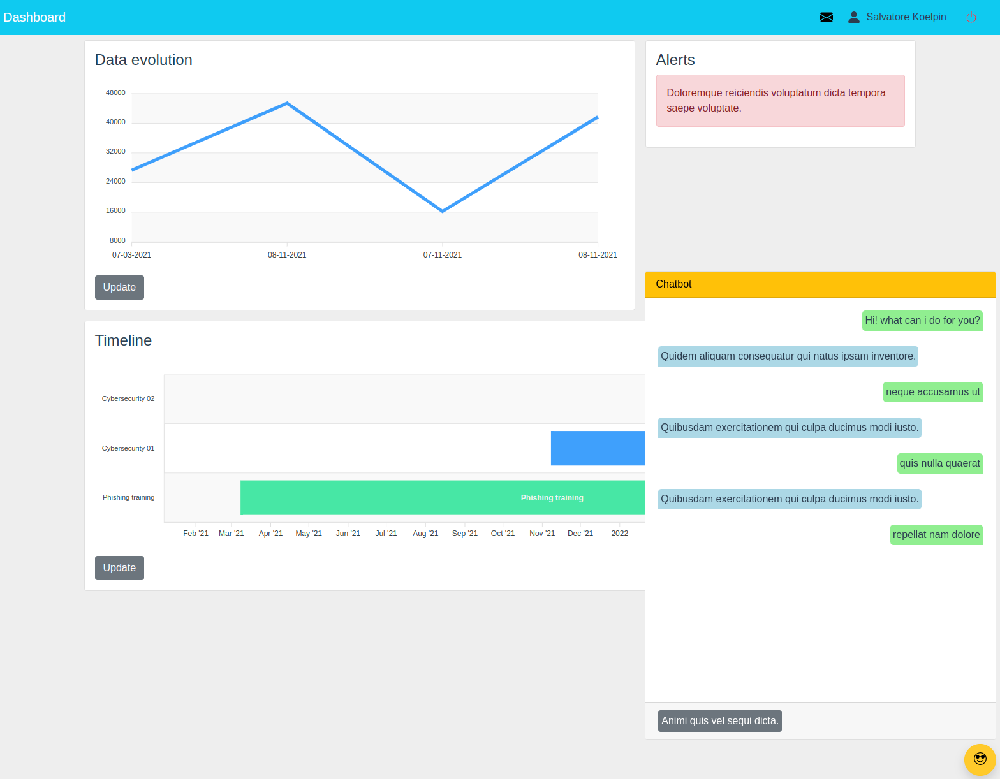

# Kymatio proof of concet

## About

In this proof of concept a user dashborad has been developed. This dashborad collects and displays data retrieved from an API and displays it in the application interface.



### Built With

The following frameworks/libraries have been used to develop this project

* [Vue][Vue-url]
* [Vuex][Vuex-url]
* [BoostrapVue][BoostrapVue-url]
* [Apexcharts][Apexcharts-url]
* [Vue-axios][Vue-axios-url]
* [Vue-moment][Vue-moment-url]

## Getting Started

### Installation
1. Clone the repository
    ```sh
    git clone https://github.com/pibloo94/kymatio-proof-of-concept.git
    ```
2. Navigate to the root folder of the application in the command line and install the required npm packages.
    ```sh
    npm install
    ```
### Usage
1. Start a Node development server.
    ```sh
    npm run serve
    ```
2. The application will open automatically in your browser at http://localhost:8080

## Goals

- [x] Fake login (write on inputs to pass the login)
- [x] Notifications (included in navbar)
- [x] User info (included in navbar, has a visual bug with avatar image)
- [x] Evolution chart (need to click on update button to show data on chart)
- [x] Timeline chart (need to click on update button to show data on chart)
- [x] Chatbot (has a visual bug with the scroll)
- [ ] Testing

## License

Distributed under the [GPL License][GPL-license-url].


[Vue-url]: https://vuejs.org/
[Vuex-url]: https://vuex.vuejs.org
[BoostrapVue-url]: https://bootstrap-vue.org
[Apexcharts-url]: https://apexcharts.com
[Vue-axios-url]: https://www.npmjs.com/package/vue-axios
[Vue-moment-url]: https://www.npmjs.com/package/vue-moment
[GPL-license-url]: https://www.gnu.org/licenses/gpl-3.0.html
